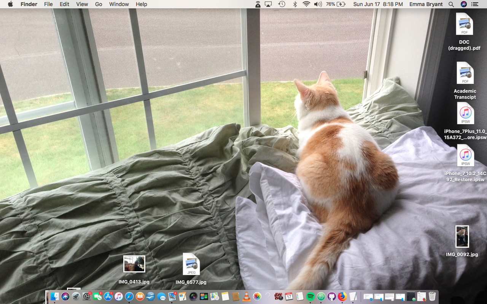

# Assignment 2

A version control system is essentially a bookkeeping record of everything that has ever been added, removed, or amended during the coding process. Whenever a user runs into an issue, the VCS allows said user to backtrack each step they have taken in the code to see where things went awry. Alternately, if a user is working on a project and instead of running into an issue they simply want to revert to how things looked before adjustments were made to the code, it allows the user to re-instate to the previous, preferred version. While still learning the basics of coding/web design, this allows all of us as students to see where things went wrong & learn from our mistakes!

Link to my [responses here.](/assignment-2/responses.txt)

This cycle was really about trying to memorize and utilize all of these links, codes, etc. without having to refer back to learning material. The one issue I ran into was starting this assignment, saving it, coming back to it a day later, and finding that my Github Desktop wasn't liking all of the additions/changes I was making to this HW assignment. I kept renaming files, moving them around, and somehow eventually was able to make my systems talk to one another again - I honestly couldn't really tell you what I did to make this happen (other than maybe the classic turn-it-off-then-back-on-again trick...)

