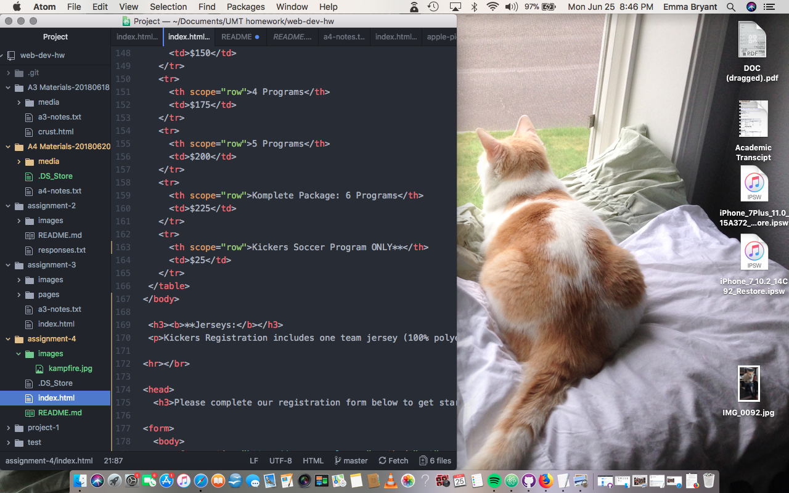

# Assignment 4

Alt text is used in HTML coding to describe what's included in an image - it is so important for accessibility (blind computer users can experience photos through what descriptions are attached within the code.) Keep it short, but the more detail the better.

There are forms all over the web - registrations (like we've worked on in A4,) online shopping (select a SIZE, COLOR, express shipping,) signing up for mailing lists, browsing for apartments on Craigslist (1br, 2br, price range, zip code,) etc. When it comes down to it, a form is there to essentially collect personal information in one way or another.

This assignment was a lot of trial/error - not in the sense of "oh, I typed in the wrong code," but more seeing what looked best bold vs italic, or what was the best way to organize my information into charts. There was a ton of formatting things one way, looking at the website, and removing everything I just worked on because I didn't think it was the best way to present information!

