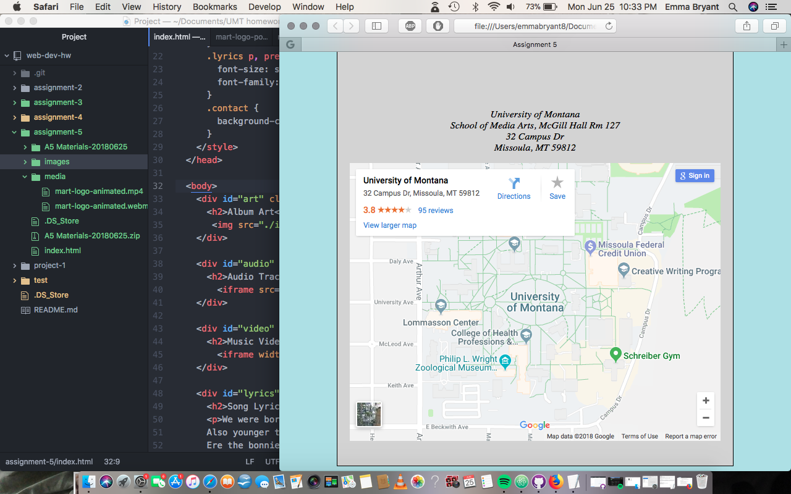

# Assignment 5

A 
 divides large amounts of information vs a  divides a small amount of information (i.e. breaking up area 1 & 2 vs breaking up first part of sentence 1 vs second part of sentence 1.) An "ID" identifies only one element vs a "CLASS" which identifies multiple elements.

The hardest thing I had to figure out was where to find embedded URL codes... I thought I was supposed to download something, but wasn't sure what it was that I was supposed to download...? This has been probably the easiest assignment I've done so far (once I figured out the embedded linking process.)

