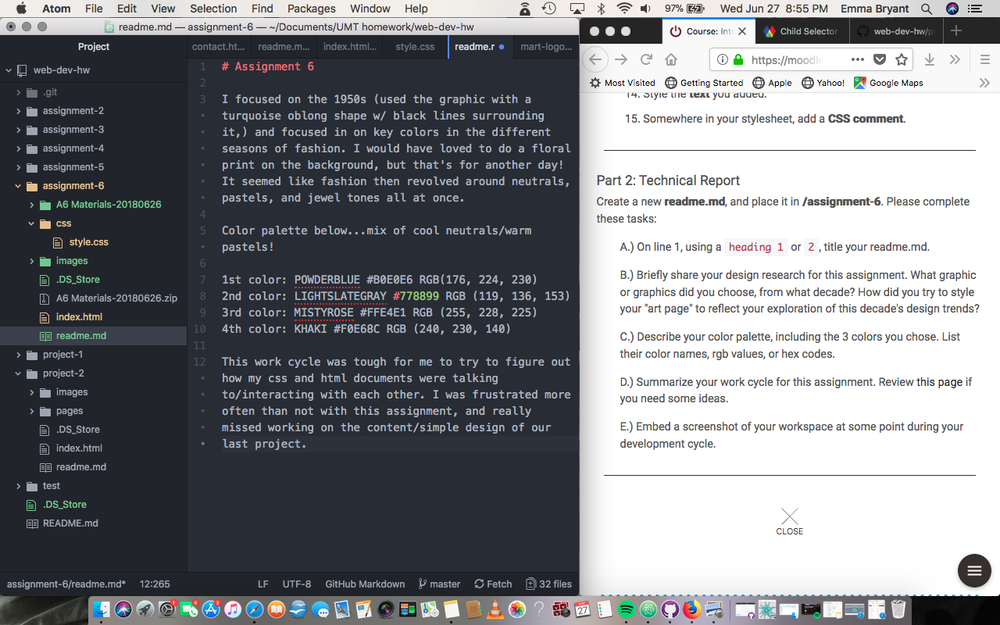

# Assignment 6

I focused on the 1950s (used the graphic with a turquoise oblong shape w/ black lines surrounding it,) and focused in on key colors in the different seasons of fashion. I would have loved to do a floral print on the background, but that's for another day! It seemed like fashion then revolved around neutrals, pastels, and jewel tones all at once.

Color palette below...mix of cool neutrals/warm pastels!

1st color: POWDERBLUE #B0E0E6 RGB(176, 224, 230)
2nd color: LIGHTSLATEGRAY #778899 RGB (119, 136, 153)
3rd color: MISTYROSE #FFE4E1 RGB (255, 228, 225)
4th color: KHAKI #F0E68C RGB (240, 230, 140)

This work cycle was tough for me to try to figure out how my css and html documents were talking to/interacting with each other. I was frustrated more often than not with this assignment, and really missed working on the content/simple design of our last project.

