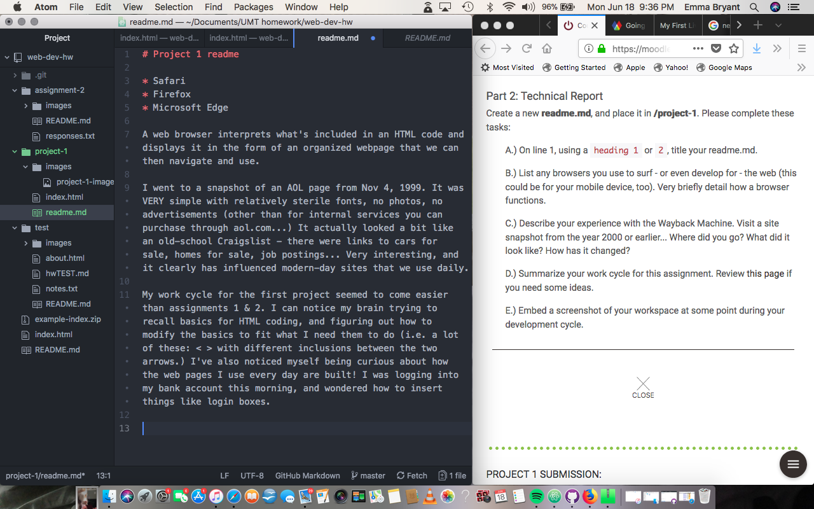

# Project 1 readme

* Safari
* Firefox
* Microsoft Edge

A web browser interprets what's included in an HTML code and displays it in the form of an organized webpage that we can then navigate and use.

I went to a snapshot of an AOL page from Nov 4, 1999. It was VERY simple with relatively sterile fonts, no photos, no advertisements (other than for internal services you can purchase through aol.com...) It actually looked a bit like an old-school Craigslist - there were links to cars for sale, homes for sale, job postings... Very interesting, and it clearly has influenced modern-day sites that we use daily.

My work cycle for the first project seemed to come easier than assignments 1 & 2. I can notice my brain trying to recall basics for HTML coding, and figuring out how to modify the basics to fit what I need them to do (i.e. a lot of these: < > with different inclusions between the two arrows.) I've also noticed myself being curious about how the web pages I use every day are built! I was logging into my bank account this morning, and wondered how to insert things like login boxes.

