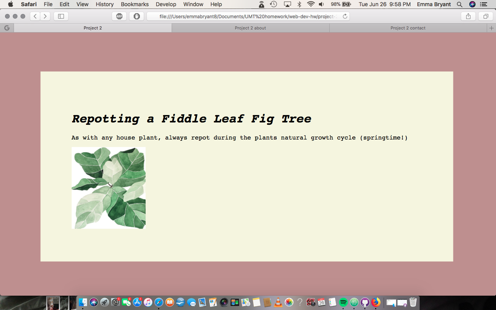

# Project 2

This project was FUN!! With such a strong design background, it was relieving to finally be able to play around with some aspects of that in this project. I also felt like I FINALLY have a grip on how to easily scan through/read codes/know exactly what part of a code/codes needs to be edited to produce what I want.

I'm excited to learn how to really bring things together, and get my live sites looking out of the late 90s, and into the 21st century!

As I said above, it was really exciting to feel like I was finally able to bring design elements into this project. Along with continuing to learn the best way to present information to viewers of my website, I focused a lot of the aesthetics of these three pages and had some fun with color, font, layout, etc.

